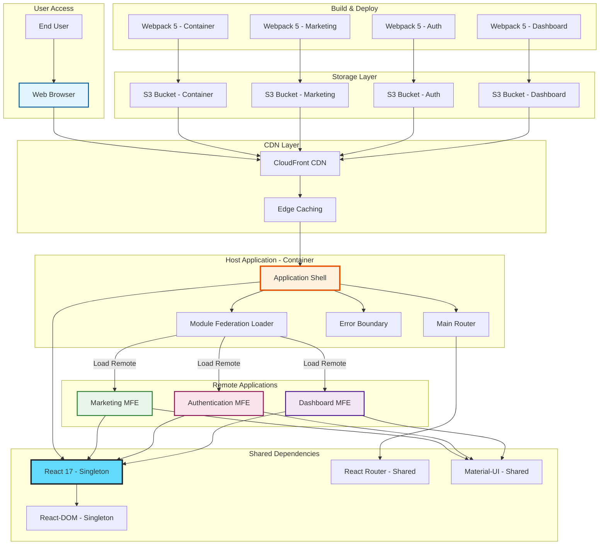

# Module Federation - System Architecture

## Overview
A micro-frontend architecture demonstration using Webpack 5 Module Federation, featuring independent deployments, runtime composition, and shared dependencies across multiple React applications.

## High-Level Architecture

## Module Federation Configuration

## Runtime Module Loading

## Routing Architecture

## CSS Isolation Strategy

## Deployment Pipeline

## Monorepo Structure

## Technology Stack

### Core Technologies
- **Webpack 5**: Module bundler with Federation plugin
- **React 17**: UI library (singleton shared)
- **React Router DOM**: Client-side routing
- **Material-UI**: Component library
- **Yarn Workspaces**: Monorepo management

### Build Tools
- **Webpack Module Federation Plugin**: Runtime module sharing
- **Babel**: JavaScript transpilation
- **ESLint**: Code quality
- **Prettier**: Code formatting

### Deployment
- **AWS S3**: Static file hosting
- **CloudFront**: Global CDN distribution
- **GitHub Actions**: CI/CD pipeline

## Key Features

### Independent Deployments
Each micro-frontend can be:
- Developed independently
- Tested independently
- Deployed independently
- Versioned independently

### Runtime Composition
- Modules loaded dynamically at runtime
- No build-time coupling between applications
- Shared dependencies deduplicated automatically
- Graceful fallback on load failures

### Shared Dependencies
- React and React-DOM as singletons
- Version consistency enforced
- Lazy loading for optimal performance
- Automatic deduplication

### CSS Isolation
- Scoped Material-UI class names
- No global style conflicts
- Independent theme management
- CSS modules support

## Performance Optimizations

### Bundle Splitting
- Vendor chunks separated
- Shared modules deduplicated
- Lazy loading for routes
- Dynamic imports for heavy components

### Caching Strategy
- Long-term caching for versioned assets
- Invalidation only when changed
- Edge caching via CloudFront
- Browser cache leveraging

### Code Optimization
- Tree shaking unused code
- Minification with Terser
- Gzip/Brotli compression
- Source map generation for debugging

## Benefits of Module Federation

1. **Team Autonomy**: Independent team ownership
2. **Technology Flexibility**: Different tech stacks per MFE
3. **Faster Deployments**: Deploy only changed apps
4. **Scalable Architecture**: Add new MFEs easily
5. **Code Sharing**: Share common libraries efficiently
6. **Independent Scaling**: Scale MFEs based on traffic
7. **Incremental Updates**: Update apps independently
8. **Fault Isolation**: Failures contained to single MFE

## Security Considerations

- CORS configuration for remote modules
- Content Security Policy (CSP) headers
- Subresource Integrity (SRI) for remotes
- HTTPS-only communication
- Token-based authentication across MFEs
- Shared authentication state
